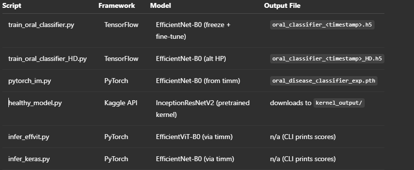

# ML Backend for Oral Health Classification

This repository provides tools to train, evaluate, and serve deep learning models for oral disease classification using both TensorFlow (EfficientNet‑B0) and PyTorch (EfficientNet‑B0 & EfficientViT‑B0) backends. Models categorize images of teeth into common conditions:

- calculus
- caries
- gingivitis
- hypodontia
- toothDiscoloration
- ulcers

## Dataset
 https://drive.google.com/file/d/13NFWEqtL_3Vxsr02ehXoYTapp63dMIDM/view?usp=drive_link

## Python Packages
pip install \
  torch torchvision timm \
  tensorflow scikit-learn seaborn matplotlib \
  pillow numpy tqdm flask kaggle

## Model Summaries

